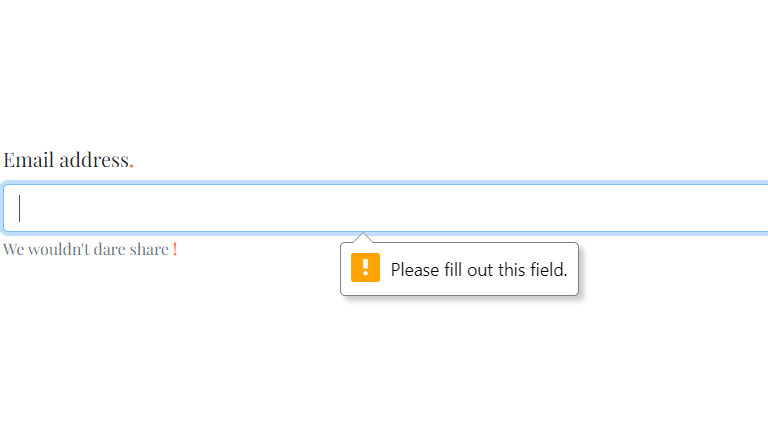
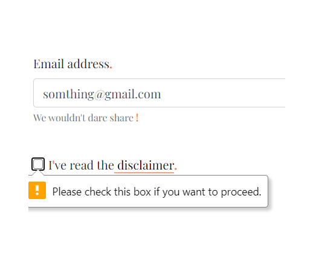
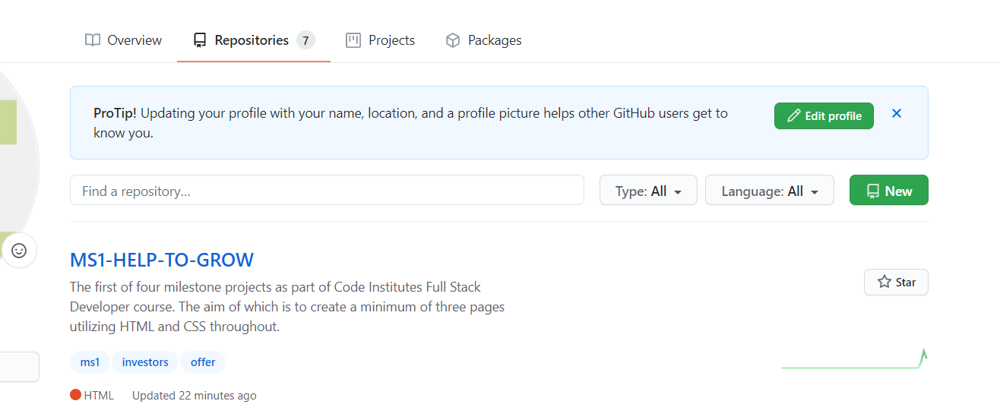
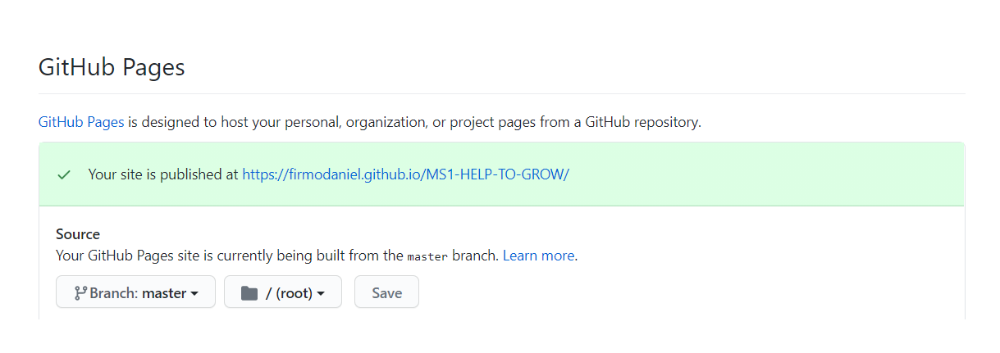
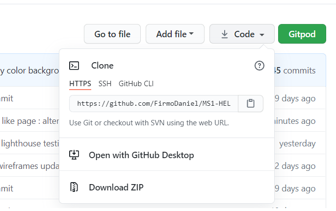

# Contents

1. [Project-Introduction](#Project-name)
2. [UX](#UX)
3. [Wireframes](#Wireframes)
4. [Features](#features)
5. [Technologies used](#technologies-used)
6. [Testing](#testing)
    
    * [links](#links)
    * [Forms](#forms)
    * [Responsivness](#responsiveness) 
    * [Performance](#performance)
    * [Validation](#validation)
7. [Deployment](#deployment)
8. [Cloning](#cloning)
9. [Credits](#credits)
10. [Acknowledgements](#acknowledgements)

# Project name: Help to Grow 
## Project aim
To enable new investors to clear what are often the two most daunting hurdles.
1. Up-front capital 
2. Readily available, reliable and custom, information.

What separates ‘Help To Grow’ from the other websites is our immediate dealing with the aforementioned hurdles.
* Our model employs a subscription base as opposed to a lengthy commission based contract. 
* We offer users immediate access to qualified advisors once signed up to our community.

We hope to scale the model out beyond the republic of Ireland to the wider European catchment market which will require a broadening of our in-house professionals.

Professionals are compensated via the subscription charge. As part of their re-numeration they are expected to create helpful content in their relevant field, engage with the community at periodic q&a’s, and ensure their own qualifications remain valid throughout their involvement.

Professionals are advised to advertise private mentoring sessions with the community for a fixed, pre-agreed-upon, fee in order to expand their own client base and ultimately the return value of remaining apart of Help to Grow site.

A live version can be found [here](https://firmodaniel.github.io/MS1-HELP-TO-GROW/).

## Project Requirements 
1. Static front end Project- Using HTML and CSS to create a website of three pages. 
    * Achieved- The site has five pages.
2. Information Architecture: Incorporate a main navigation menu and structured layout.
    * Achieved- the site's header, footer and colour scheme are consistent throughout.
3. Documentation- Write a README.md that explains what the project does and the value it provides.
    * Achieved- The below outlines the site's merits and usability.
4. Version Control - Use Git & GitHub for version control.
    * Achieved- A list of commits can be found [here](https://github.com/FirmoDaniel/MS1-HELP-TO-GROW).
5. Deployment- Deploy final version to GitHub pages.
    * Achieved- See deployed site [here](https://github.com/FirmoDaniel/MS1-HELP-TO-GROW).
6. Attribution- Maintain clear separation between code written by you and code from external sources.
    * Achieved- See example from 'index' html.

## UX

#### Strategy & Scope planes
The website is targeted at new users, and initially splits them into two categories for easy, example representation. 
* Over Forty
* Under Forty

We then offer simple examples of available options to both categories, with a push toward the greater rewards that accompany membership.

New investors come with a myriad of varying questions, so we aim to keep the initial experience concise while also demonstrating our knowledge and how we can help.

While most sites operate a costly commission based fee, Help to Grow offers a minimum fee subscription offer with easy entry and penalty-free exit.

In terms of scope the current site was kept conscise so as not to overwhelm beginner investors.

### Initial visit : User Story 1
* Upon my initial visit:
> I want to see the natural navigation links.
* _**Site response:**_ : Users are greeted by standard header and footer navigation links.
> I want to find a clear site goal to ensure this is the site for me. 
* _**Site response:**_ : Our goal is prominetly displayed on the landing page. 
> I do not want to be overloaded with financial data or immediate calls to action.
* _**Site response:**_  The site uses cards with images to exhibit the offer without bombarding the user.

### Initial visit : User Story 2
* Upon my initial visit:
> I only have €100 to invest each month and I want to buy Bit-Coin.
* _**Site response 1**_ : Our landing page contains two links. Both port to Cryptocurrency options.  
* _**Site response 2**_ : We also offer addition information on our 'Things we like' page. 

### Initial visit : User Story 3
* Upon my inital visit:
> I have a pension, isn’t that enough?
* _**Site response**_ : Our landing page contains two links. Both port to pension options as **part** of an overall portfolio.

### Returning visit :
* Upon my return visit:
> I want to sign up.
* _**Site response**_ : The 'Sign Me Up' page is quickly accessible via the header navigation bar. 
A reminder of membership benefits is also prominent.
        
### Wireframes
#### The Structure & Skeleton planes
In keeping with the uncomplicated approach agreed upon in our Scope plane, the initial wireframes were created
with consistency in mind so each advancing page's style follows the previous.

_Note:_ First draft wireframe pdf’s are included in this project. The main variation from which was the addition 
of mirroring cards to both the 'index' and 'things we like' pages in keeping with our Structure & Skeleton planes ideals.
* [index](wireframe/wireframe-index-first-draft.pdf)
* [over-forty](wireframe/wireframe-over-forty-first-draft.pdf)
* [under-forty](wireframe/wireframe-under-forty-first-draft.pdf)
* [sign-me-up](wireframe/wireframe-sign-me-up-first-draft.pdf)
* [things-we-like](wireframe/wireframe-things-we-like-first-draft.pdf)

## Features
### The Surface Plane
Overall the site is responsive and scales with user screen size. 

The site follows a succinct colour theme of **Orange** (#ff4800c5) paired with **Black** throughout,
these colours are inchanged periodically to avoid visual fatigue. 

The lead colurs are accompanied by headers and footers splashed **Pale Green** (#c6e0c1) to naturally border the pages, 
and a single font is used globally to maintain cohesiveness.
### Existing Features
* Index : Features a background image repeated throughout. Cards with images from Bootstrap. Quotes which follow a fixed style but vary in text. Info on all [here](#credits). There are links at page end to promt users deeper into the site. 
* Forty + : Contains a compact list of suggestions based on users selected age group. Page end contains a link to sign up.
* Forty - : Mirroring the 'Forty +' here we display an altered list of suggestions based on users selected age group. Page end contains a link to sign up.
* Sign Me Up : we offer a quick and easy sign up, requiring only an email address and confirmation the user has read our disclaimer which is linked in the form. We also provide an optional space to share addition information. Page end contains a link to further information on the 'Things We Like' page.
* Things We Like : The information is organised into cards with images. Info on all [here](#credits). There is also a minor push to sign up via a link at page top-right.
* Footer : Links provided to fictional social medias.

### Features left to implement 
* Sign Me Up: We would like to allow users sign up in full on this page by implementing some back-end structure and incorporating a secure direct payment method.

## Technologies used
* HTML-For basic structure.
* CSS-For styling and required Media Query outside of Bootstrap.
* [W3C validator](https://validator.w3.org/)-Used in testing HTML and CSS.
* [GitHub](https://github.com) -For deployment.
* [GitPod](https://www.gitpod.io/) -IDE.
* [Bootstrap (including JQuery)](https://getbootstrap.com) -Utilized for responsiveness via columns, forms and buttons.
* [Font Awesome](https://fontawesome.com) -Used for all icons.
* [Google Fonts](https://fonts.google.com) -Used for primary font employed throughout. [PlayFair Display](https://fonts.google.com/specimen/Playfair+Display?query=playfair).
* [Visual Studio](https://code.visualstudio.com) -For offline work.
* Google Chrome's Responsive Viewer found [here](https://chrome.google.com/webstore/detail/responsive-viewer/inmopeiepgfljkpkidclfgbgbmfcennb)
* [ImageMagick](https://imagemagick.org/index.php) -Used for resizing images after initial Lighthouse test on mobile.
* Google Chrome's lighthouse function.

## Testing
### Links
#### Manual Testing
* Index links
    * At 'Index' page end two links are presented in buttom-form.  
        * I'm over 40
        * I'm under 40
    * _Both links when selected lead to the assigned pages._

* Over 40 links
    * At 'Over Forty' page end one link is presented in button-form.
        * I'm Ready to Start
    * _The link when selected navigates the user to the 'Sign Me Up' page._

* Under 40 links
    * At 'Under Forty' page end one link is presented in button-form.
        * I'm Ready to Start
    * _The link when selected navigates the user to the 'Sign Me Up' page._

* Sign Me Up links
    * At 'Sign Me Up' page bottom two links are presented in text-form.
        * 'disclaimer' housed within the form
        * 'Things We Like' 
    * _'disclaimer' link when selected navigates the user to sample pdf on a new tab._
    * _'Things We Like' link when selected navigates the user to the 'Things We Like' page._

* Things we links
    * At 'Things We Like' page top one link is presented in text-form.
        * 'signed up!'
    * _The link when selected navigates to the 'Sign Me Up Page' page._
    * At 'Things We Like' page body there are twelve cards each with external links divided  evenly among three sections. (1)Asset-types we like. (2)Exchanges&Providers we like. (3)People we like.
        * Asset-types we like 'Show me more!'
            * ETF's
            * Bonds
            * Dividend Aristocrats 
            * Crypto Currencies
        * _Each link when selected diverts the user to an external wikipedia address in a new tab._
         * Exchanges&Providers we like 'Take me there!'
            * Kraken
            * Mintos
            * Degiro
            * MoneyCube
        * _Each link when selected diverts the user to the intended provider's homepage an external in a new tab._       
         * People we like 'Tell me more!'
            * J.L. Collins
            * The Joseph Carlson Show
            * Dave Ramsey
            * Paddy Delaney's Informed Decisions
        * _Each link when selected diverts the user to the intended person's homepage an external in a new tab._ 
### Forms
#### Manual Testing
* Sign Me Up form
    * At 'Sign Me Up' page bottom one form is presented with four components.

Component 1 | Component 2 | Component 3 | Component 4 |
------------- | --------- | ----------- | ----------- |
Email address | Optional Addition Information | checkbox with link to disclaimer | Button to submit |
Requires a '@' within the email address | optional | Checkbox is required | Two requirements needed before subbmission |

**Upon accepted submission** wherein the following criteria are met.
* Email has '@'
* Checkbox is ticked

The form clears it's contents.

**Upon failed submission** wherein one of the two requirements are not met.
1. Where the email is blank or doe not contain '@' the user is prompted.

2. Where the email is correct but the checkbox remains un-checked the user is prompted.

### Responsiveness
#### Screen sizes
I used Google Chrome's Responsive Viewer found [here](https://chrome.google.com/webstore/detail/responsive-viewer/inmopeiepgfljkpkidclfgbgbmfcennb).
The following are exerts from three tests.
##### Test @ 300 x 567 

##### Test @ 320 x 635

##### Test @ 1024 x 800

### Performance
#### Lighthouse tests - Mobile

##### Lighthouse Initial mobile test highlighted issues such as:
* Oversized cards.
* Duplicate Bootstrap links.
* Missing labels in footer icons

##### Using Image Magick I reduced the sizes by 50%. Also corrected the duplicate links and footer icons.

##### Lighthouse Mobile overall results 

| Page  | Overall  | Performance  | Accessibility  | Best Practise  | Seo |
|---|---|---|---|---|---|
| Index  | 90  | 86  | 95  | 86  | 92  |
|  Over 40 | 90  | 81  | 95  | 93  | 91  |
| Under 40  | 93  | 92  | 95  | 93  | 91  |
| Sign me Up  | 91  | 84  | 97  | 93  | 91  |
| Things we Like  | 89  | 90  | 95  | 79  | 92  |

#### Lighthouse tests - Desktop

##### Lighthouse desktop.

##### Lighthouse Desktop overall results 

| Page  | Overall  | Performance  | Accessibility  | Best Practise  | Seo |
|---|---|---|---|---|---|
| Index  | 90  | 92  | 93  | 86  | 90  |
|  Over 40 | 93  | 98  | 92  | 93  | 89  |
| Under 40  | 93  | 96  | 92  | 93  | 89  |
| Sign me Up  | 94  | 96  | 97  | 93  | 89  |
| Things we Like  | 91  | 96  | 93  | 86  | 90  |

_Note_: Lighthouse proposed other fixes but most were beyond my capability. 

### Validation
Using [W3C validator](https://validator.w3.org/) both HTML and CSS were checked by direct input. Issues arising were promptly corrected. 

    

## Deployment
The project was developed using [GitPod](https://www.gitpod.io/) workspace, committed to git and pushed to [GitHub](https://github.com) using the built in function within Gitpod.
To deploy this page from the [GitHub respository](https://github.com/FirmoDaniel/MS1-HELP-TO-GROW), the following steps were taken.
1. Log in to **GitHub**.
2. From the list of repositories on screen select 'MS1-HELP-TO-GROW'

3. Select **Settings** from the menu.
4. Scroll down to **GitHub Pages**

5. Under **Source** click the dropdown menu labelled **none** and select the **Master Branch**.
6. On selecting **Master Branch** the is automatically refreshed, the website is now deployed.
7. A link can be found in the **GitHub pages section**, and also in the about section within **MS1-HELP-TO-GROW**.

8. [Link to site](https://firmodaniel.github.io/MS1-HELP-TO-GROW/)

### Cloning
1. Go to GitHub Repository: [Help To Grow](https://firmodaniel.github.io/MS1-HELP-TO-GROW/)
2. Select 'Code' dropdown button (next to green 'gitpod' button).
3. These are your three options 

    * Copy the URL to your local IDE such as [Visual Studio](https://code.visualstudio.com).
    * Intsall [GitHub desktop](https://desktop.github.com/).
    * Download the Zip file and use with local IDE such as [Visual Studio](https://code.visualstudio.com).

## Credits
### Content
Header quotes taken from google search results of ‘Financial Quotes’
### README
Structure taken from [Code Intsitute webinar](http://bit.ly/devlabs_README_anna) 
### Media
* Background image [Sapling in jar of coins](https://images.unsplash.com/photo-1579621970590-9d624316904b?ixlib=rb-1.2.1&auto=format&fit=crop&w=1050&q=80)
* Card images- 'Index' page.
    * [People-Whiteboard](https://images.unsplash.com/photo-1532622785990-d2c36a76f5a6?ixlib=rb-1.2.1&ixid=eyJhcHBfaWQiOjEyMDd9&auto=format&fit=crop&w=1050&q=80)
    * [Pen-Paper-Chart](https://images.unsplash.com/photo-1543286386-2e659306cd6c?ixlib=rb-1.2.1&auto=format&fit=crop&w=1050&q=80)
    * [People-Talking](https://images.unsplash.com/photo-1556761175-b413da4baf72?ixlib=rb-1.2.1&ixid=eyJhcHBfaWQiOjEyMDd9&auto=format&fit=crop&w=967&q=80)
    * [Money](https://images.unsplash.com/photo-1589556763393-59ab0f56b811?ixlib=rb-1.2.1&auto=format&fit=crop&w=1051&q=80)
    * [Yes](https://images.unsplash.com/photo-1560174971-443de64be852?ixlib=rb-1.2.1&auto=format&fit=crop&w=967&q=80)
    * [Meeting](https://images.unsplash.com/photo-1454165804606-c3d57bc86b40?ixlib=rb-1.2.1&ixid=eyJhcHBfaWQiOjEyMDd9&auto=format&fit=crop&w=1050&q=80)
* Card images - 'Things we like' page.
    * [ETF image](https://thumbs.dreamstime.com/z/etf-exchange-traded-funds-concept-table-keywords-letters-icons-colored-flat-vector-illustration-white-etf-exchange-119009035.jpg)
    * [Bond image](https://www.investmentz.com/images/bond.png)
    * [Dividend Aristocrat image](https://www.allincomestream.com/wp-content/uploads/2020/04/dividend_aristocrats.png)
    * [Cryptocurrency image](https://i.pinimg.com/originals/4c/62/f5/4c62f589819458c32785ec9f2d69c026.jpg)
    * [Kraken image](https://themerkle.com/wp-content/uploads-new/2016/01/0WWCVDaH_400x400.png)
    * [Mintos image](https://3.bp.blogspot.com/-k5CiR2IQKG8/W4mpwPzi_uI/AAAAAAAAAGs/-fAFHT4zpqotg_Hz9fOicygrGiWNN--5ACLcBGAs/s640/Mintos_logo_1000px.png)
    * [Degiro image](https://upload.wikimedia.org/wikipedia/commons/thumb/6/68/Degiro.jpg/1200px-Degiro.jpg)
    * [MoneyCube image](https://i-invdn-com.akamaized.net/companies_logos/125067_1550587261.png)
    * [J.L. Collins image](https://the7circles.uk/wp-content/uploads/2016/06/Simple-Path-to-Wealth.jpg)
    * [Joseph Carlson image](https://cdn.podimo.com/images/02b1091b-7ec6-4812-b6b5-391bd091767f_400x400.png)
    * [Dave Ramsey image](https://pbs.twimg.com/profile_images/378800000250594141/8479b63c02b71130a03e218ae805ce85_400x400.png)
    * [Paddy Delaney image](https://ssl-static.libsyn.com/p/assets/a/6/a/3/a6a32c57b3d5361b/New_Podcast_Art_image.jpg)
### Acknowledgements 
I received inspiration for this project from Code Institute -Love Running- tutorial, which is why I opted for background images behind the header quotes, and a neat footer.

